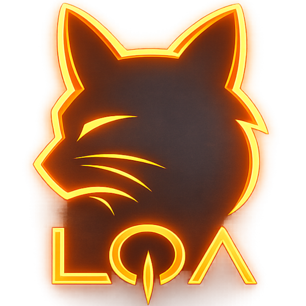

#  MeowGang Tracker

**A lightweight desktop companion for Lost Ark roster, raid, gold, and task tracking.**

[](https://github.com/nobodyeuw/MeowGang/releases)
[](https://opensource.org/licenses/MIT)
[](#)
[](https://tauri.app/)

MeowGang Tracker helps reduce the manual work of managing Lost Ark rosters. It tracks characters, raid setup, weekly gold, daily and weekly tasks, LOA Logs completion data and market estimates in one local-first desktop app.

[Download Latest Release](https://github.com/nobodyeuw/MeowGang/releases) | [Report Bug](https://github.com/nobodyeuw/MeowGang/issues)

---

## Highlights

| Feature | Details |
| :--- | :--- |
| **Dashboard** | View roster status, tracked raids, weekly gold progress, dailies, weeklies, roster events, and MeowConnect state at a glance. |
| **To Do** | Track daily, weekly, roster-wide, and raid-gate completion states with stable per-gate difficulty display. |
| **Raid Settings** | Configure raid gates, planned difficulties, gold earning, bonus boxes, and static/friend reservations per character. |
| **Tracking Settings** | Choose which daily, weekly, roster, and raid tasks each roster should track. |
| **LOA Logs Integration** | Local encounters can auto-complete raid gates, update character data, and optionally help friends through MeowConnect clear hints. |
| **Themes** | Switch between bundled visual themes from System Settings. |
| **Local First** | Core roster, tracking, gold, and settings data are stored locally in SQLite. |
| **Tauri Desktop App** | Built with Tauri 2, SvelteKit, TypeScript, and Rust for a small native Windows app. |

---

## Under Development

### Progression Planner

The Progression Planner is still under active development. Parts of the feature may be incomplete, hidden, or change between releases while market price support, character details, accessory values, gem values, and upgrade efficiency calculations are refined.

Stable areas of the app are the dashboard, roster setup, tracking, raid configuration, gold progress, LOA Logs integration, market estimates, updates page, and MeowConnect.

---

## Quick Start

### Installation

1. Download the installer from the [Releases](https://github.com/nobodyeuw/MeowGang/releases) page.
2. Run the installer and launch the app.
3. Sign in with Discord when prompted so the app can verify whitelist access.
4. Add a roster character, configure raids, and enable MeowConnect if you want friend availability sharing.
5. Optional: set your `encounters.db` path from Settings if LOA Logs auto-detection does not find it.

### Development

```bash
# Clone and install
git clone https://github.com/nobodyeuw/MeowGang.git
cd MeowGang
npm install

# Run the Tauri app in development
npm run tauri dev

# Build production installer
npm run tauri build
```

### Prerequisites

- Node.js 18+
- Rust 1.70+
- Git
- Tauri prerequisites for Windows

### Useful Commands

```bash
npm run build          # Build frontend only
npm run dev            # Frontend dev server only
npm run check          # Svelte/TypeScript diagnostics
cargo check            # Check Rust code from src-tauri
cargo fmt              # Format Rust code from src-tauri
```

Run Rust commands from `src-tauri`:

```bash
cd src-tauri
cargo check
cargo fmt
```

### Discord Auth

The desktop app uses Discord OAuth with Authorization Code + PKCE. No Discord client secret is shipped in the app.

The Discord application must allow these local redirect URIs:

```text
http://127.0.0.1:53682/discord/callback
http://127.0.0.1:53682/supabase/callback
```

For local development, whitelist access still requires `DISCORD_WHITELIST_URL` to point at the configured whitelist source.

---

## Privacy & Safety

- Local app data: core roster, tracking, gold, completion, and settings data stay on the user's machine.
- MeowConnect: only explicitly enabled characters and completion/reservation data are uploaded.
- MeowConnect access: accepted friends can read shared data through Supabase RLS.
- Discord: login is used for whitelist verification and MeowConnect identity.
- LOA Logs: encounter data is read locally from `encounters.db` when configured or auto-detected.
- Secrets: never commit Supabase service-role keys, Discord client secrets, local `.env` files, local app data files, or private signing keys.
- Third-party notice: this is a fan project and is not affiliated with Smilegate RPG or Amazon Games.

## License

Distributed under the MIT License. See `LICENSE` for more information.

## Credits

Made with love for MeowGang.
